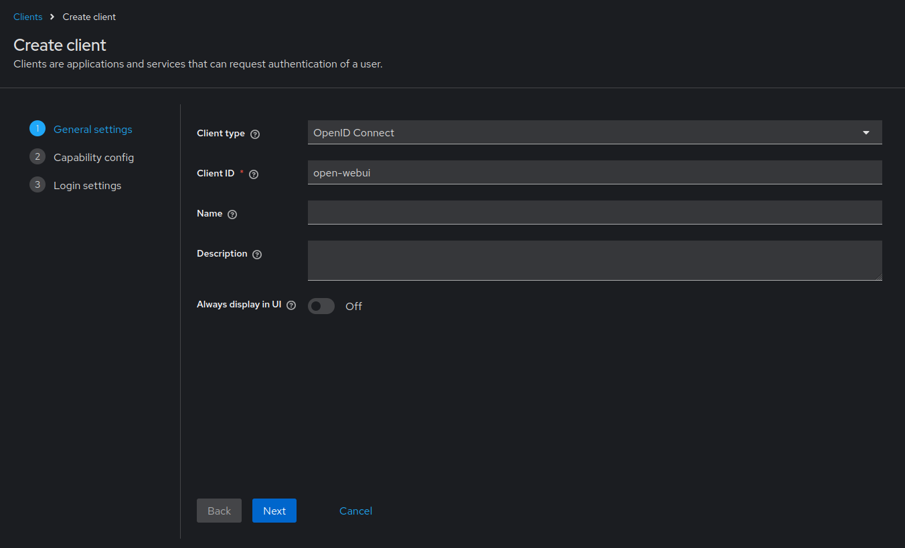
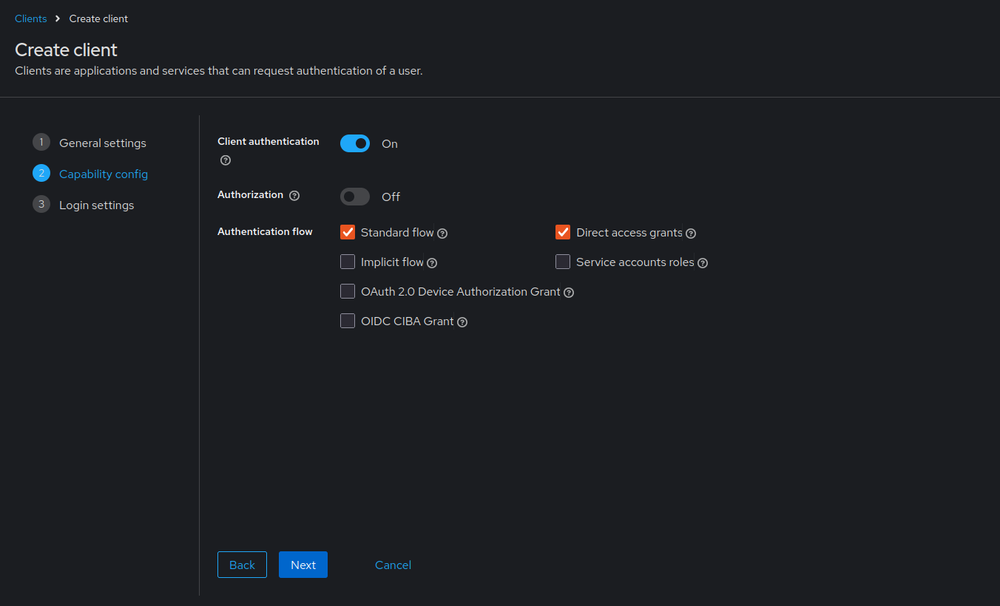

# open-webui_keycloak

A Docker Compose setup that integrates Keycloak (an open-source identity and access management solution) with the open-webui secure interface. This project provides a ready-to-run environment for managing authentication via OAuth and OpenID Connect.

## Prerequisites
- Docker
- Docker Compose

## Installation
1. **Clone the Repository**
   ```bash
   git clone https://github.com/notyusheng/open-webui_keycloak.git
   cd open-webui_keycloak
   ```
2. **Configure Environment Variables**
   
   An example environment file (`example.env`) is provided. It contains variables for both the Keycloak and open-webui services. Update the file as needed:

   Rename or copy `example.env` to `.env` (or use it directly with the Docker Compose command):
   ```bash
   cp example.env .env
   ```

3. **Run Docker Compose**
   Start the services with:
   ```bash
   docker-compose up -d
   ```
   Docker Compose will automatically load the environment variables from the `.env` file.

## Post-Installation Keycloak Setup

After starting your containers, follow these steps to configure Keycloak for integration with open-webui:

1. **Create a Client in Keycloak:**
   - **Log In:** Access the Keycloak admin console using your bootstrap admin credentials.
   - **Navigate to Clients:** Click on the **Clients** section in the left-hand menu.
   - **Create a Client:** Click the **Create client** button.
     - **Client ID:** Define a unique client ID (e.g., `open-webui`).
     - **Client Protocol:** Select **OpenID Connect** as the client type.
     - Click **Next** to proceed.



2. **Configure Client Capabilities:**
   - **Client Authorization:** In the capability configuration section, toggle **Client authorization** to **ON**.
   - Click **Next** to continue.



3. **Set Login Settings:**
   - **Valid Redirect URIs:** In the Login Settings tab, update the **Valid redirect URIs** field with your open-webui callback URL. For example:
     ```
     http://your-open-webui-domain/oauth/oidc/callback
     ```
   - **Optional Settings:** Optionally, set the **Root URL** or **Home URL** for your Keycloak instance.


4. **Save and Record Credentials:**
   - **Client Credentials:** After saving the client configuration, note down the client ID you defined.
   - **Client Secret:** Navigate to the **Credentials** tab to retrieve the client secret.
   - **Update Environment:** Paste the client ID and client secret into your `.env` file so that open-webui can authenticate with Keycloak.

5. **Create a User for open-webui:**
   - **Navigate to Users:** In the Keycloak admin console, go to the **Users** section.
   - **Add a User:** Click **Add user** and complete the required details for the new user.
   - **Set Password & Permissions:** Configure the user’s password and assign any necessary roles or permissions required for open-webui access.

6. **Verify Your Setup:**
   - Visit the open-webui login page.
   - Attempt to log in with the newly created user credentials.
   - A successful login and redirection to open-webui confirms that your Keycloak configuration is working as expected.
  
## Reference
This project takes references from the step-by-step guide from Joshua Stock.

For more information, please check out the original guide:
[Getting Started with Authentik or Keycloak and Open Web UI – A Step-by-Step Guide](https://blog.joshuastock.net/getting-started-with-authentik-or-keycloak-and-open-web-ui-a-step-by-step-guide)
